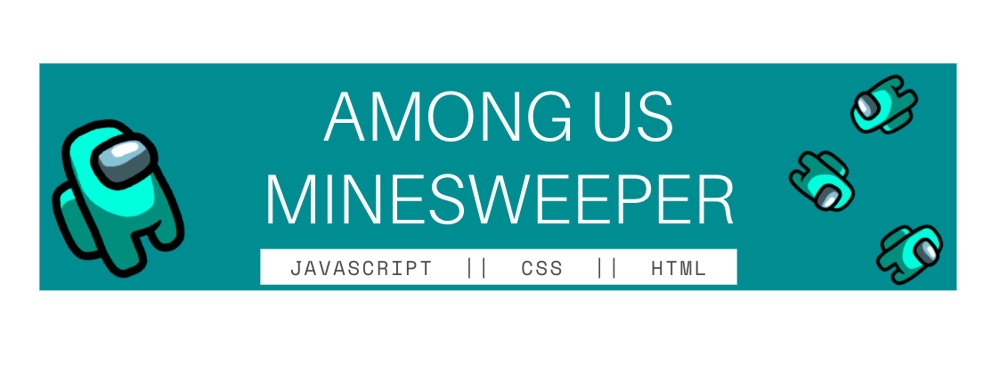
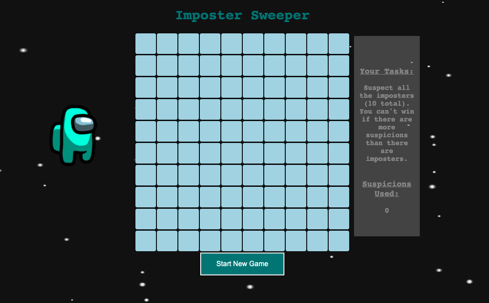
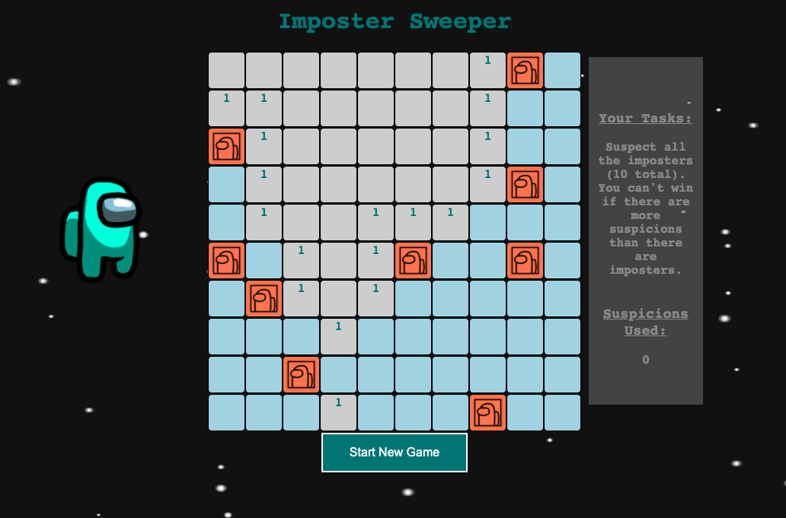
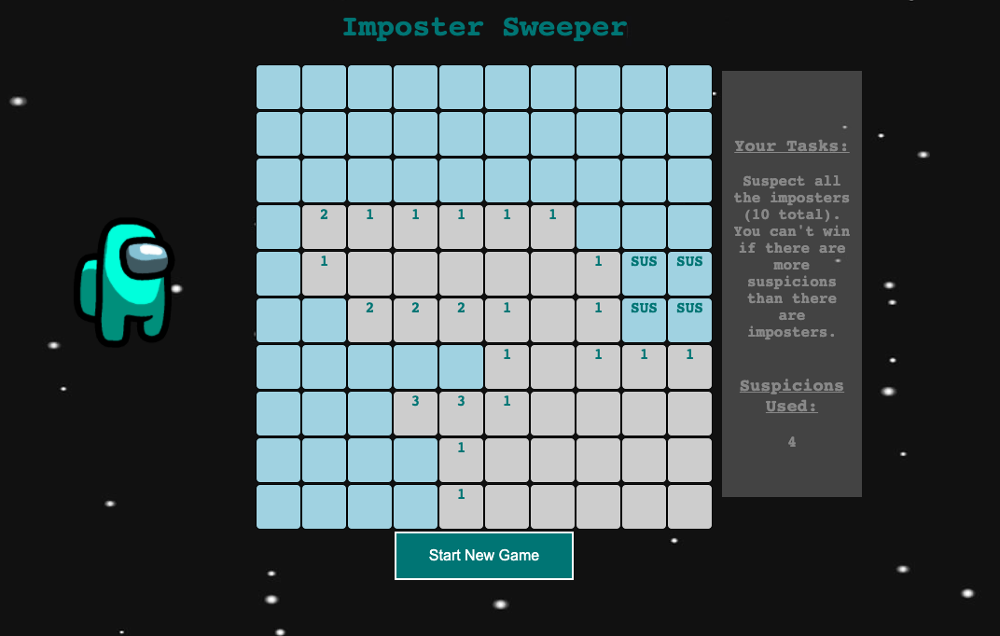
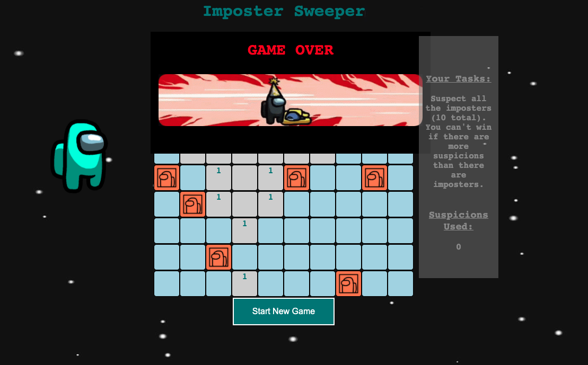
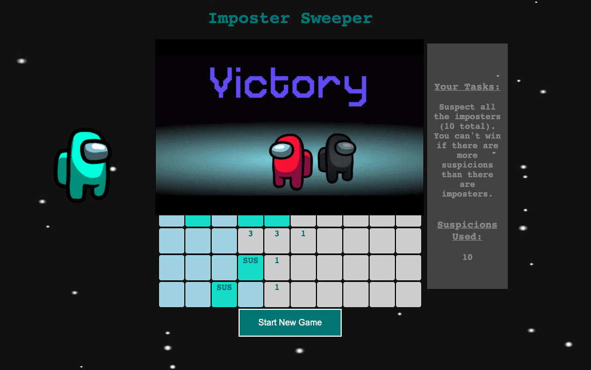
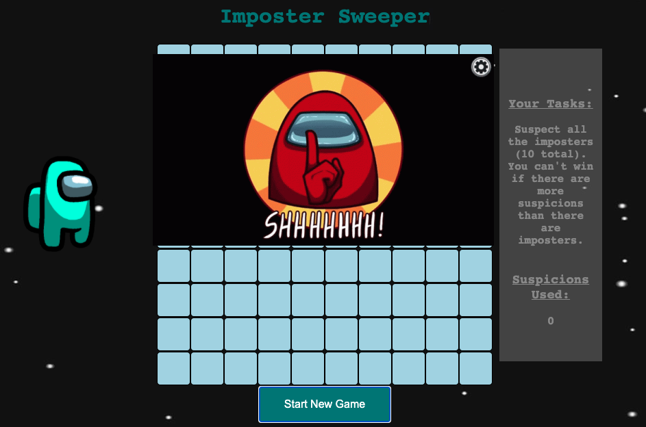

# MINESWEEPER (AMONG US THEMED)
---
## Table of Contents

* [About the Project](#about-the-project)
* [Technologies Used](#technologies-used)
* [Getting Started](#getting-started)
* [Next Steps](#next-steps)

# About The Project
Minesweeper is a single-player game where the objective is to clear and mark all hidden "mines" or "bombs" without detonating them. The player does this by using clues from neighboring tiles that display how many bombs are touching it. The player right clicks the tiles they believe are bombs to mark them with flags, and if all bombs are marked correctly, the player wins. If a player clicks one bomb, all bombs will activate and the game is over.

For this version, there's a fun twist where all the bombs are "imposters" from the game Among Us. If you activate one imposter, all will appear.

Using the help of numbers of neighboring tiles, you go through and mark each suspected imposter tile with a "SUS" instead of a flag. If the player marks all the imposters correctly without triggering them, then the player wins! 

There are also some fun themed animations and sounds that are triggered when the game ends, and when you start a new game.

<!-- TABLE OF CONTENTS -->

# Technologies Used

* Javascript for interactive functions
* CSS for Styling
* HTML for bones and set up

# Getting Started

[Click to play the game](https://vkosiyan.github.io/Minesweeper){:target="_blank"}

## Controls
* `Left-click` - reveals a block
* `Right-click` - places a SUS to mark your suspected imposter
* `Right-click` - right-clicking an already marked SUS will remove it

## How to Play
* All squares are safe to click except for 10 imposter squares. If you click on an imposter square, all the imposters will appear, and then it's game over
* Your first click will never be an imposter
* If you open a square with no neighboring imposters, it will automatically open all neighbors until it reaches numbers
* These numbers show how many bombs are touching it. It will check all sides and corners of its square (left, right, top left, above, top right, bottom left, below, and bottom right).
* How to win:
    * Mark all suspected imposters with a "SUS"
    * If you have marked any non-imposter squares with a "SUS", you must unmark them in order to win the game. You can use the "Suspicions Used" counter in the right Task Bar to help keep track of your markings.

* Click the "Start New Game" button to load a new game and board

# Next Steps

## Features I'd like to add to enhance this project:

* Improve Marks Counter
    * Make the suspicions counter turn red once it surpasses 10 SUS marks
* Difficulty Levels 
    * Add a dropdown menu with levels that change the number of tiles and imposters (bombs) on the board depening on the difficulty
        * Easy
        * Medium
        * Hard
* Theme Selection
    * Add a dropdown menu for theme selection. Originally I wanted Among Us to be a them selection instead of the main layout. I'd like the player to be able to choose a style or theme they like best with maybe three options.
        * Basic Mode (regular Minesweeper)
        * Among Us
        * Another undecided theme
* Timer
    * I'd like to add a timer to add a time limit to play for the player
* Question Mark Feature
    * I'd like to add a third clicking feature where they can mark imposters (bombs) that they are unsure about. These would not have to be unmarked in order to win the game if they are incorrect guesses.
